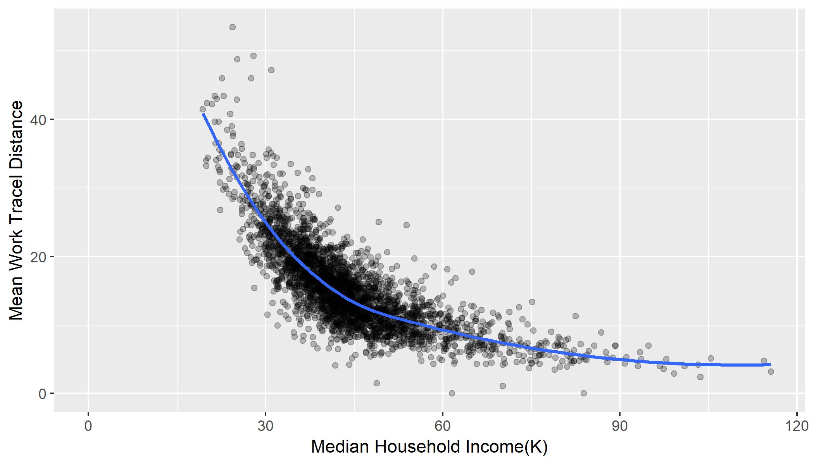
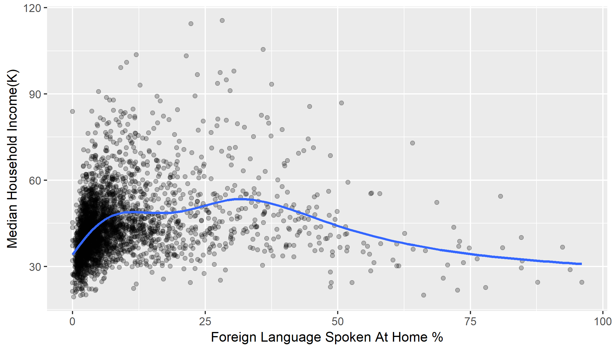

presentation
========================================================
author: Yinshu Zhang
date: Feb. 3rd, 2019
autosize: true
font-family: 'Helvetica'


this slides demostrate publishing presentation with "R presentation", following slides visualize the data of household income and travel distance to work, and foreign language speaking family and hoursehold income.

Introduction
========================================================
Home work assignment "deveoping data products" <https://www.coursera.org/learn/data-products/peer/tMYrn/course-project-shiny-application-and-reproducible-pitch>.

### US 2010 county census demo. 

The data is from US 2010 census, in previous assignment data was processed and saved, for detail check github repo at <https://github.com/yszhangit/onemorehomework>, the shinyApp can be found at  <https://yszhangit.shinyapps.io/onemorehomework/>.

Code sample
========================================================
<small>
- plot house hold income in thousands and average home to work travel distance.


```r
g1 <- ggplot(dat, aes(x=median_household_income/1000, y=mean_work_travel_distance)) +
  geom_point(alpha = 0.25) +
  geom_smooth(method = "loess", se =F) +
  xlim(c(0, max(dat$median_household_income/1000))) +
  labs(x="Median Household Income(K)",
       y="Mean Work Tracel Distance")
```
- plot house hold income in thousands and foreign language speaking family.


```r
g2 <- ggplot(dat, aes(x=foreign_language_spoken_at_home_pct, y=median_household_income/1000)) +
  geom_point(alpha = 0.25) +
  geom_smooth(method = "auto", se =F) +
  labs(y="Median Household Income(K)",
       x="Foreign Language Spoken At Home %")
```
</small>

Income and travel distance
========================================================


<small>
The trend shows higher the income, shorter the travel distance between home and office.
</small>

Income and foreign language speaking family
========================================================


<small>
The x axis show the precentage of family speak foreign language at home in a county, y axis show median income. the plot doesnt clearly related between those two.
</small>
